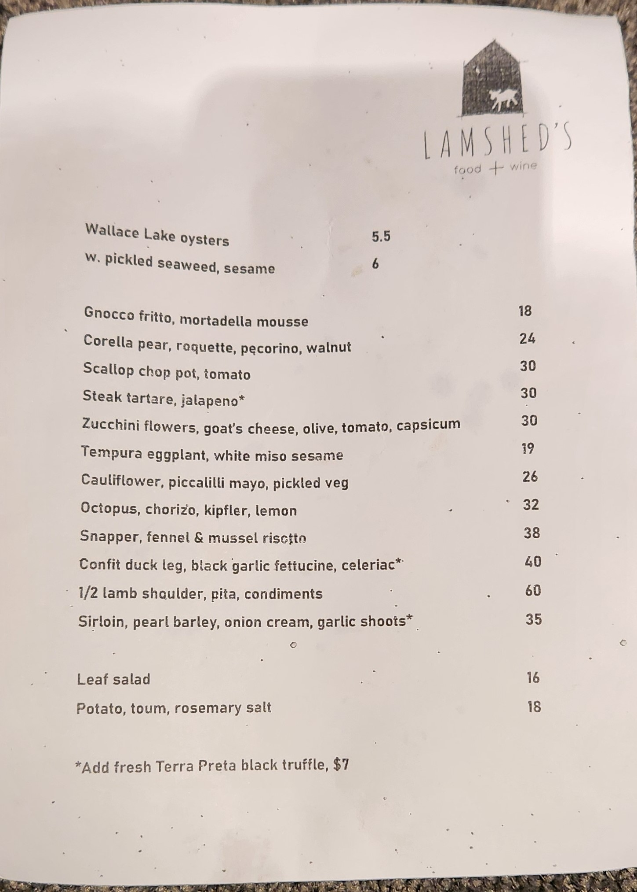

icon:material/briefcase-eye

# Briefing

Essentially, you will likely be floating or looking after a section. Each role entail different responsibilities. The following pages will expand more on that. 
But first, some prerequisites.
 
## 1. Preparing for Your Shift

#### Dress Code
- There is no explicit dress code but wear something that looks professional.

### 1.1. Pre-Shift Briefing

<figure markdown="span" >
  { width=90% }
  <figcaption> 
  jk
  </figcaption>
</figure>

- Come in 5-10 minutes early, have a cup of coffee, get to know what's happening. 'Doesn't hurt'.

## 2. Knowing the menu

<figure markdown="span" >
  { width=70% }
  <figcaption> 
  Menu Front Page
  </figcaption>
</figure>

This is the front page of the menu. Usually how it works is: the food is on the left side, pricing on the right.

- Starts with oyster, two options: natural or pickled.
- Including the Snapper, everything from it down are the mains, above it are the entrees. The bottom two are sides, usually goes with the mains.
- Most of the items on the menu are designed to share.
- Desserts are on the back of the a la carte menu. To give after clearing the mains.

### 2.1. Food portioning
A single dish is generally portioned enough to share among 4 people. Consult with Chefs for more infromation and keeping up with the menu.

- The recommended number of dishes for sharing food are:  
4 for 2 people.  
2x-1 for 'group of people <= 4', so 5 dishes for 3 people and 7 things for 4 people.
 
- Multiples of 5 is a bit tricky. It is more of the same number (2x-1) but some dishes are recommended to be double to be enough to share for 5.
- For group > 5 < 9, the recommended number is 2* times recommended number for 'group of people <= 4'.
- For group > 11 < 14, the recommended number is 3* times recommended number for 'group of people <= 4'  

!!! note
        For larger groups, set menus are prefered, potentially the $75 per head suprise set.

There are various types of set menus.
> $75 per head surprise set menu. Easy for table with dietary complications. 
>
> $110 per head set menu. Printed, more tailored towards the number of people. Can be changed to adjust customer needs with consulting with the chefs.
>
> $165 matching wine. Same food as the $110 set with matching wine in each course. See the matching wine list on the Menu section of the Bar.
>
> $85/90 per head surprise set menu with desserts.

## 3. Greeting and Seating Guests

### 3.1. Initial Greeting
- Smile and greet guests warmly as they enter the restaurant.
- Ask if they have a reservation or if they are looking for a table.
- There usually will be a runsheet on the counter, find the table and number of people in that table, grab the exact amount of a la carte menu, a set menu and wine list for every multiple of 4 or less than 4.

### 3.2. Seating Guests
- Lead guests to their table, holding menus.
- Once seated, provide each guest with a menu and offer tap or sparkling water.

## 4. Refer to assigned roles next
- If you are floating, refer to the next page.
- Once you are familiar with your duty as a floater, you can be responsible for handling sections.

## 5. Post-Shift Duties

### 5.1. Cleaning
- Clean your assigned sections including tables and banquet areas, and the bar.
- Clean the beer tap and coffee machine.
- Empty out the beer bucket and the bins.
- Replace the bin liner and give the recycling bin a bit of a clean up by spraking hot water from the hose in the kitchen. 

### 5.2. Restocking
- Restock sparkling water in the white wine fridge. The sparking water boxes are found under table 16. 
- Restock the white wines by the glass by grabing the wines from the shelf.

### 5.3. Reporting
- Report any issues or feedback from guests to your manager and the chefs.
- Prepare for the next shift by ensuring everything is in place.

## 6. Helpful tips
- Communicate clearly with team members.
- Work efficiently and stay organized.
- Try to build up a collaborative environment. 
- Keep aware of your surroundings, potential needs, and requirements.
