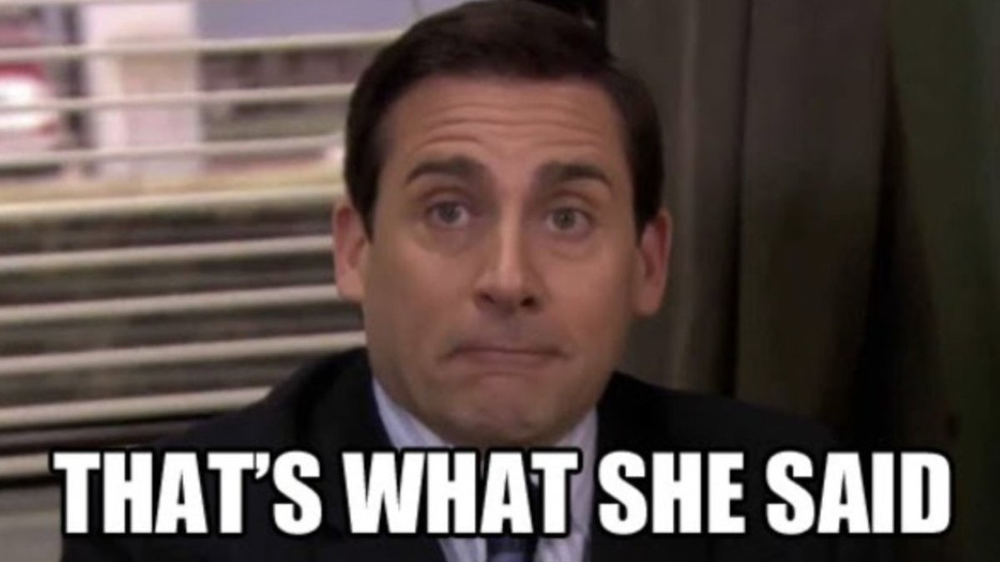

icon:material/floor-lamp-torchiere-variant

# Floating

As a floater, you are more responsible for running food to the table, sorting and polishing cultery, folding napkins, and cleaning up after table. 

## 1. Running food

- Be present in the pass after the bell is rung. 
- Take a shared cutlery for each plate of food deliverd to the table.
- Let the guest know which food is being handed in the table.
- Ensure correct food reaches the intented table.
- Make sure the right person receives the right food in terms of dietary modified food.    
- Clear empty share food plates in the middle if present.

## 2. Polishing

### 2.1. Polishing glasses

- As mentioned in the layout page, when the glass rack is full send it through the machine, put a fresh rack in the drying section of the sink.
- When the machine is done, set the metallic tray in the bar, tilt the rack a little to get the excess water on top out before pulling it out of the macine and placing it on top of the tray.
- Get a dry cloth that are on top of the coffee machine. If not there, try the bottom right part of the file cabinet. There should be one. Then after:
    <ol> 
    <li>Hold the long end of the cloth on one hand and place the glassware on the same hand covering with the cloth. </li> 
    <li>Insert the unused end of the cloth to inside the glass completely.</li>
    <li>Holding it from the inside and outside, move through the glass to cover the wet spots until dry.</li>
    </ol>
    
<ul>
    <li>After getting done with polishing, put everything where they belong and clean up afterwards.</li>
</ul>

> Polishing might differ for different types of glasses. Practical tutorial is preffered, ask experienced staff for demonstration.
>
> for eg: for polishing champagne flute, whilsting holding the other end, you have to grab one of the tip of the cloth and push it all the way to the bottom.  
> <figure markdown="span" >
    { width=50% }
    <figcaption> 
    </figcaption>
    </figure>

### 2.2 Polishing cutlery

#### 2.2.1. Sorting cultery
- When asked, grab the dirty cutlery tray that is on top of the dish washing station.
- Collect forks, spoons, and knife on each empty section of the tray.
- If filled, get excessive cultery on the last empty section or get the less commmonly used cutlery on that section.
- Take it to the bar, more precisely on top of the by the glass white wine fridge.

#### 2.2.2. Setting up and polishing
- Place the dirty tray on the edge of the counter.
- Get two or three wine coolers and fill with hot water from the sink. If the water does not feel hot enough, get water from kitchen.
- Place each tyoe of cutlery in the hot water and let it soak for a minute.
- Get the clean from the other side of the bar and get one or two dry cloth.
- Similar to glasses:
    <ol> 
    <li>Hold the long end of the cloth on one hand and place a handful of cutlery on the same hand covering with the cloth. </li> 
    <li>Using the other end, run it up and down from the top to bottom of the cutlery for two or three times.</li>
    <li>Once dry, place them on the clean tray.</li>
    <li>Repeat until every thing is done</li>
    <li> Throw out the water from the wine cooler in the sink and put it back where it belongs.</li>
    <li>Get the dirty tray back to the kitchen</li>
    <li>Sort out the clean cultery back to the cutery stations.</li>
    </ol>
<ul>
After getting done with polishing, put everything where they belong and clean up afterwards.
</ul>

## 3. Folding napkins
> Visual demonstration recommended.

- Once foded properly, stack them alternatively and place them in their relative station.

