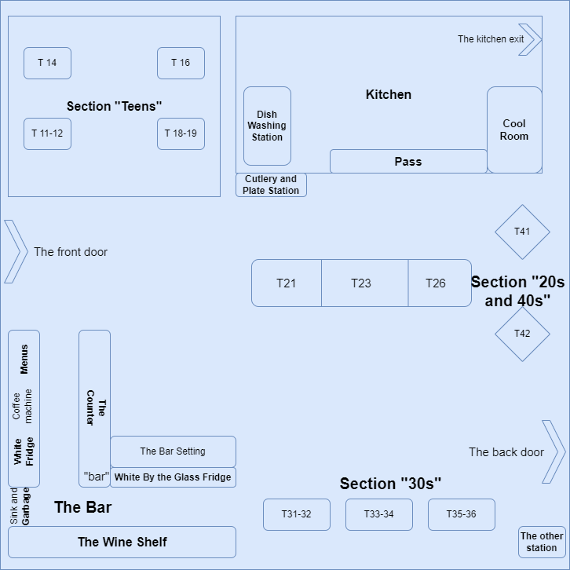

icon:material/glass-wine

# Starting from the Layout

Now that we are familiar with every one in the restaurant, let's look at the blueprint of the floor.
The image below is roughly how the restaurant is laid out, although it is slightly out of proportion, this is to give you a general idea.

<figure markdown="span">
  { width="80%" height="50%"}
  <figcaption>The Layout</figcaption>
</figure>

*Please refer to the layout image for reference on any of the topics below.*
 
Now that we know the layout, let's see where what things are. This protion is divided by sections of the restaurant, but you can always rely on the 'Search' tab in the top right corner of the webpage for help.

The first one is:
## The Bar
The bar is filled with so many things, some of which you will never need, nevertheless, we will go throuh the essentials. 
Since the bar is filled with most of your necessities, we will separate the bar into few more segments.
 
#### The Counter
Begining with the counter, you will find the laptop, iPads, EFTOS machine, the router, some stationary, and power port to charge your phone. Below the bar, on the left most side, you will find a file cabinet, inside which is the printer, papers, and some teabags. This is also where you will keep the tip jar once you are done with your shift. On its left, there is a paper guillotine. Use that to make paper note pads to take order. 
  
*Note*: There are two iPads, one with a cracked screen and one without. Music is always played on the one without. You can put the orders in either. 
 
You can check bookings and print runsheet from the laptop. *{To be updated}*   

On its right is the glass racks and the soft drinks section. The lower deck is the spirit tumblers and the above two are short water glasses. There is also the *clean* cutlery tray stashed on top of the glass racks. 
 
Further right, there are two empty racks aligned vertically. Use that to store dirty glasses in the sink drying section to be sent to the glass washer.

Moving on the next "bar" section.
You will likely be making cocktails and polishing glasses there. Put a metallic tray before getting the dirty glasses rack over the bar. The metallic tray is usually behind the sink. 

#### The Coffee Machine, and Menus

Starting from the right-end, closer to the door, there are menus stacked in between containers labeled Sugar, Tea, and so on. There are 4 different types of menus. The leftmost is the A la carte or main menu, on its right is the set menu, then the set menu wines, and finally the set menu docket. The wine list is on the edge, its the one with leather cover.
The containers contain sugar packets and tea bags. Open them up to find out what's in which. 
 
On top is a small shelf, which contains teaspoons and port glasses.
   
On its left is the coffee grinder. Between the grinder and the containers are paper notes and pencil/pens. Use that to note orders. There is also the tamper and padding to press coffee.
   
Next is the coffee machine itself. Essentially, there are the portafilter, milk jars and cleaning chemical around it. To learn how to operate this beauiful piece of machinery, [Click Here](https://www.youtube.com/watch?v=7GaB72fbQ8I&ab_channel=HenrysHowTos)
  On top of the coffee machines are the cups and polishing cloths. 

!!! note "Coffee Note"
     We only use the lite milk and regular coffee. No decaf or any other type of milk. This is not a cafe and you are not a barista.

   

##### The liquor shelf
Just above the coffee machine is the liquor shelf. Consult other front staff for any questions regarding that shelf.
   

#### Sink and Garbage

Just as the name says, it's a sink. There is also a dunker where you are to fill hotwater and soap. Dunk the dirty glasses and place them in the rack in the draining section. On the right of the draining section is where the chemical spray to wipe down the tables is. Once full or 3/4 full, send them into the glass washing machine just under the metallic tray on the right. The metallic tray that holds all the water bottles. Fill the empty bottles with cold water before and during your shift. Empty them out during closing.
 
Under the sink is the Garbage bin.
  
Throw any garbage there. When it's full or at the end of the shift, take the garbage out and dump it in the bins outside. Change the bin liner. You will find black bin liners on top of the dish washing station in the kitchen.

> You will also find light switches there, turn them on to light up the bar at the start of the shift. Turn them off at the end of the shift

!!! note

    The things you need for the sink can be found in the kitchen. Ask the kitchen staff for stuff like chux or dishwashing liquid, etc.

There is an ice machine between the garbage and gass machine. Inside are two scoops. Use as required. 

#### The Glass Machine
This will make or break your shift. Be very cautious when using this.
 If the display shows dotted lines, it means the machine is off.

<ul>
  <li>Press On/Off button to turn it ON. Let it load up the water.</li>
  <li>Set the machine to Pr1 and press Start. Let the machine complete program. On completion, it'll show END and after some time the usual message.</li>
  <li>If this is the first run, run it again after the Pr1 is completed to make sure the machine is heated up.</li>
  <li>You can use the machine normally after this, just open the door, put the glass rack, close the door and press start.</li>
  <li>Place another rack from the counter to the drying station.</li>
  <li> Set the metallic tray on the bar to put the glass rack on top of it so the water is collected in the tray.</li>
  <li>After the program ends, open the door, tilt the rack a little to get the exccess water on top out and put the rack on the tray.</li>
  <li>Grab a cloth and start polishing. *How to polish on later section* </li> 
</ul>

> Make sure to put the things where they belong and wipe the bar when you're done.

!!! note "Important" 
    
    When you are done using the machine at the end of the shift , press the "P" button until the display shows "Dr", the Drain program and press Start. This will automatically turn off the machine. You can also set the program to "Cle" to clean the machine at the end of the day.

#### White Wine fridge
The fidge you find below the coffee machine is where white wines are chilled. There are two of every bottle. Make sure to replace it from the shelf when you take one out. The wines are on "the wine shelf" in 'The Bar'. 
 
On the right most side of the fridge, there are sparking water and milk. Restock them when needed. Sparking water boxes can be found unter "Table 16" in 'Section Teens'. 

#### The Wine Shelf
All the wines in the wine menu should be on the shelf. The shelf is segmented into 4 sections. The top three contains the wine.
The second one from the bottom also contains the Red wines by the glass on the left most side. On its right most side, there are the champagne flutes and the glass yours truly uses to drink water. 
 
The bottom shelf houses the regular wine glasses on the left, some expensive wines in the middle, different types of glasses, a candelabra, and lighers. On it's right, decanters, tall glasses, soda water, and San Bitters.   
 

Under the wine shelf, there are some wine boxes. Stack them in the shelf if necesasry.
 

*More importantly*, there is a bin for dirty napkins, which, if full, transfer some in a bin liner, and place them under baby cots right next to it. 
There could also be beer kegs, if there is any empty one, take it outside from the back door.

#### By the glass 'White Wine' Fridge

The whites and roses are on this fridge. The left part of the fridge contains the can beers, ciders, citruses, prosecco, and cold glasses for the beer.

On top of this fridge is the counter where you can find different mixers to make cocktails. On the leftmost side, there are all the stuff needed to make cocktails. There is also the beer tap on the left side. Ususally, the right most side has the wine coolers.
   
Under the beer tap is the beer keg and the machine that runs the tap. On its right, between the fidge and keg is the place where the recycling bin is. When full or at the end of the shift, empty it out on the bins outside.

> If there are customers still in the restaurant, sneak it through the kitchen back door.

#### The Bar Setting
Set the bar so people can sit while waiting for table. Also to be used when having staff dinner. 
  Make sure there is a candle buring near the flower vase when working dinner shift.

